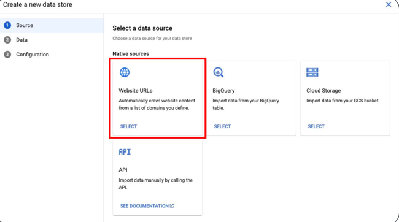
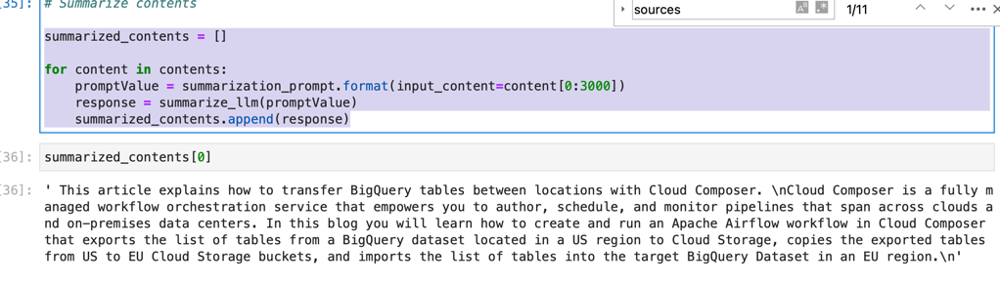
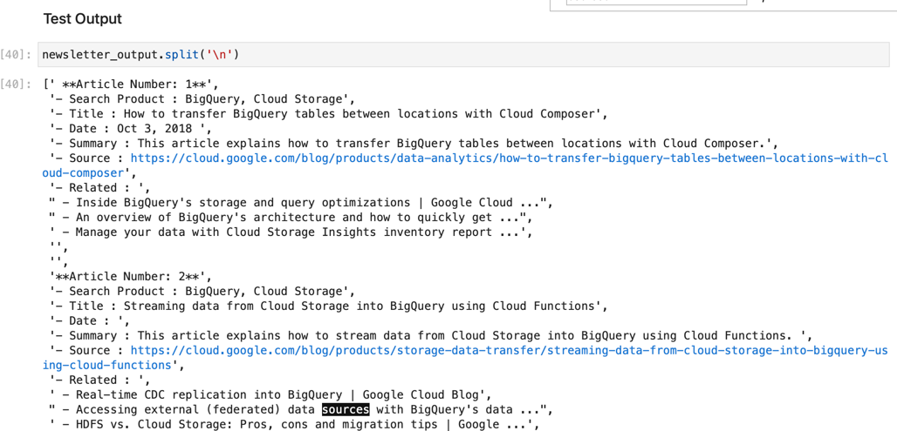
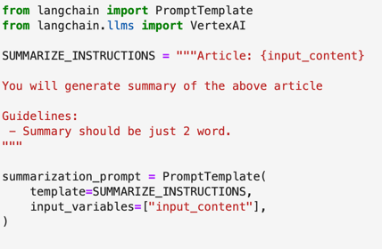
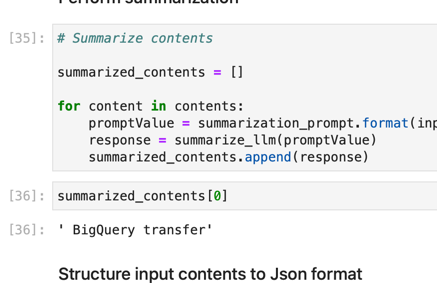

# Generative AI Hands On
* GCP의 Vertex AI 이용하여 특정 소스의 데이터를 덤프하고 그걸 이용해 llm을 구축할 수 있음
  * 가용 데이터 소스 : web / bigquery / cloud storage / API
  * 
  * 예를 들어 web을 소스로 한다면 아래와 같은 형태로 대상 지정 가능
  * 
  * 특정 웹 사이트에 대한 indexing 을 지정할 수 있음

```python
SUMMARIZE_INSTRUCTIONS = """Article: {input_content}

You will generate summary of the above article

Guidelines:
 - Summary should be 4-5 sentences long
"""

summarization_prompt = PromptTemplate(
    template=SUMMARIZE_INSTRUCTIONS,
    input_variables=["input_content"],
)
summarize_llm = VertexAI(model_name="text-bison", temperature=0.1, max_output_tokens=1024)

summarized_contents = []

for content in contents:
    promptValue = summarization_prompt.format(input_content=content[0:3000])
    response = summarize_llm(promptValue)
    summarized_contents.append(response)
```
* summarize를 한다면 VertexAI의 text-bison 모델 사용하여 위처럼 Prompt만으로 결과를 얻을 수 있다.
* 
* summarize 된 결과 예제
```python
NEWSLETTER_WRITING_INSTRUCTIONS = """Product Search : {searched_product}
Product Article Summaries : {structured_contents_input}

You will generate a newsletter with the above article summaries

Article format:
 **Article Number:**
 - Search Product : Product Search
 - Title : title of each article
 - Date : extract date from the each article's snippet
 - Summary : summary of each article
 - Source : source of each article
 - Related : 3 related articles of each article
"""

newsletter_writing_prompt = PromptTemplate(
    template=NEWSLETTER_WRITING_INSTRUCTIONS,
    input_variables=["searched_product", "structured_contents_input"],
)

newsletter_writing_llm = VertexAI(model_name="text-bison", temperature=0.1, max_output_tokens=1024) # You can try text-bison-32k also

promptValue = newsletter_writing_prompt.format(searched_product=search_query,
                                           structured_contents_input=structured_contents)
newsletter_output = newsletter_writing_llm(promptValue)
```
* news letter를 최종적으로 두번의 llm 모델을 수행하여 summarize + formatting을 진행한다.
* 
* 최종적으로 생성된 news letter
* 재밌는 점은 prompt에 마지막에 추가한 ` - Related : 3 related articles of each article`은 실제 블로그의 Related topic이 아니라는 점
* AI 모델이 검색한 컨텐츠 10개중 페이지 내의 related 를 분석하여 3개를 추가한 것

* 아래와 같이 summary를 just 2 word로 변경하면
* 
* summary의 결과가 아래와 같이 바뀐 것을 볼 수 있다
* 