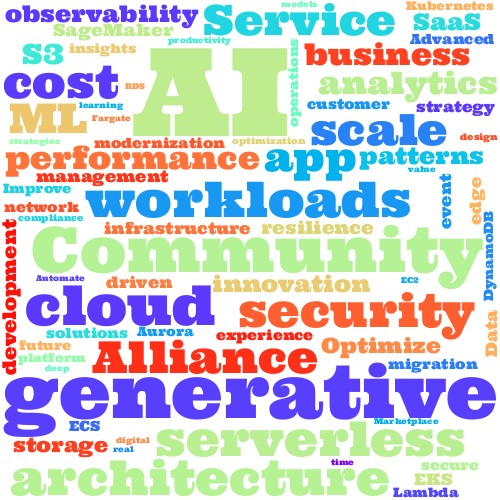
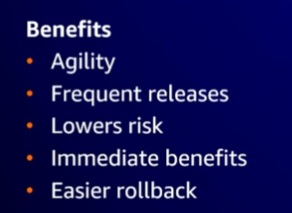
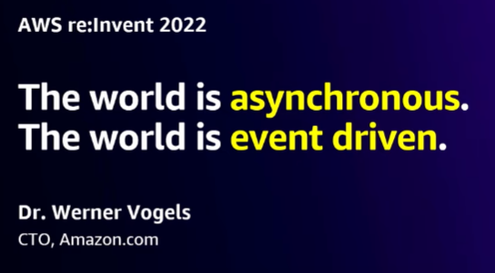
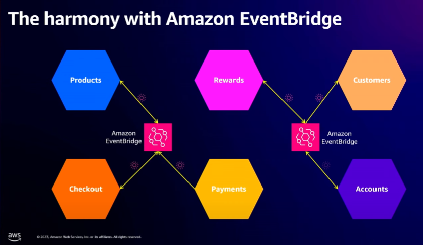
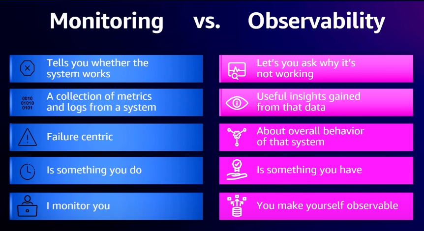
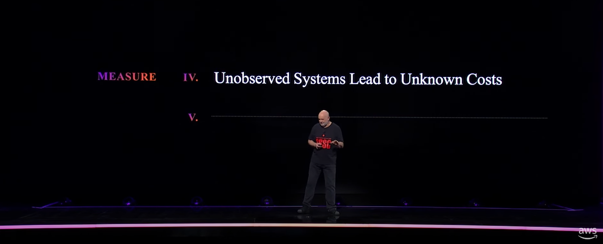
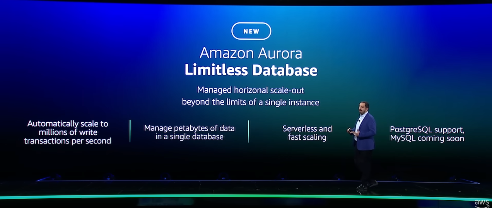

# AWS re:invent 2023 summary

* 모든 session의 제목 출현 빈도로 만든 Word cloud 

## 가장 큰 화두는 결국 Generative AI
* 어떻게, 얼마나 쉽게 안전하게 generative AI를 만들 수 있는가

## 그렇다면 AI를 빼면 re:invent의 최고의 화두는 무엇이었을까
* Modernization Architecture
* Observability
* Serverless

### AWS는 왜 Modernization Architecture를 주장하는가
**표면적인 이유**
* 시장의 빠른 변화에 대응할 수 있다
* 배포에 의한 리스크를 줄일 수 있다

**실제**
* monolithic service를 MSA로 변경하기 위해선 cloud화가 반드시 필요하기 때문이 아닐까?
  * 결국 더 많은 고객을 만들어낼 수 있는 방법으로 생각한것 같다

### AWS가 말하는 Modernization Architecture는?

> event driven 되어 있는 이 세상을 구현하는 architecture는 이렇게 생겼다

> 각 도메인을 명확하게 분리하고 이 도메인을 건너가기 위해서는 이벤트를 발행, EventBridge(message bus)를 통해야 한다
>
> 각 도메인은 완전히 decoupling 되어 있기 때문에 각자의 이유로 스케일링되고 변경 될 수 있다

### Modernization Architecture(MSA)는 그럼 문제가 없을까?
* 여러가지 문제가 있겠지만
  * 결국 아무리 잘하더라도 많은 component수에서 오는 운영적인 어려움은 architecture가 커질수록 폭발적으로 증가한다
### 그래서 여기서 등장한것이 Observability
* Observabilty는 Monitoring과 어떤 차이가 있을까?
  * Monitoring은 이 component가 정상이다 아니다만 말해줄 수 있다
  * Observability는 이게 어떻게 동작하고 있는지, 왜 동작하고 있는지까지 알려주는 것

### 그럼 ODD(Observability Driven Development)는 MSA의 문제를 해결할 수 있을까?
* Observability는 Architecture를 쉽게 관찰하고 진화시킬 수 있도록 한다
  * 마이크로서비스는 이벤트 분리, 스트랭글러 패턴, 도메인 주도 설계를 통해 점진적으로 발전한다.
* 많은 수의 component를 효과적으로 관찰하고 관리하는 방법
* 그래서 필요없는 모듈을 통폐합하거나 축소하거나, 또는 제거할 수 있다
  * 관측 가능한 경우와 그렇지 않은 경우는 비용을 줄이는데 큰 차이가 있다
  * 
  * [TheFrugalArchitect LAW IV](https://thefrugalarchitect.com/laws/unobserved-systems-lead-to-unknown-costs.html)

### 그래도 Component가 너무 많은게 문제라면 우리가 줄여줄게, Serverless!
* Event driven을 위해 Message bus(kafka)도 운영해야하고
* Component마다 하나씩 Mysql도 운영해야 하고
* 모듈이 너무 많아, 너희들은 business만 해 그런건 우리가 해줄께
  * Limitless Aurora
  * 
  * Limitless ElasticCache
  * 

---
# Sessions
* [Advanced event-driven patterns with Amazon EventBridge (COM301-R)](https://www.youtube.com/watch?v=6X4lSPkn4ps&t=573s&ab_channel=AWSEvents)
* [Keynote with Dr. Werner Vogels](https://www.youtube.com/watch?v=UTRBVPvzt9w&t=2533s&ab_channel=AmazonWebServices)
* [Building observability to increase resiliency (COP343)](https://www.youtube.com/watch?v=MARiKxvrdmc&ab_channel=AWSEvents)
* [Observability best practices for hybrid environments (BIZ211)](https://www.youtube.com/watch?v=qufTkqH_fEE&ab_channel=AWSEvents)
* [Building an effective observability strategy (COP325)](https://www.youtube.com/watch?v=7PQv9eYCJW8&ab_channel=AWSEvents)
* [Driving down the cost of observability (DOP224)](https://www.youtube.com/watch?v=AjcN0LhzyFA&ab_channel=AWSEvents)
* [Keynote with Peter DeSantis](https://www.youtube.com/watch?v=pJG6nmR7XxI&ab_channel=AWSEvents)
* [AWS re:Invent 2020: Application modernization](https://www.youtube.com/watch?v=CdEDhWdmutQ&ab_channel=AWSEvents)
* [AWS re:Invent 2022 - Building and scaling a modernization strategy (ENT214)](https://www.youtube.com/watch?v=NvDrtlrNPgk&ab_channel=AWSEvents)