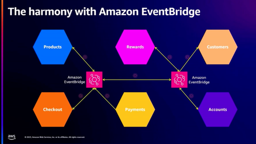

# Agenda
- EDA
- Fundametal elements of EDA
- EDA and Amazon EventBridge
- Designing events
- Service choreography
- Functionless patterns
- Resiliency with circuit breaker
- Distributing orchestrations
- Gatekeeping boundaries

## EDA
* The world is asynchronous.
* The world is event driven.

* 일반적인 sync에는 문제가 없음
* 그러나 즉시 처리할 수 없는 요청을 만들어 냈을때 문제가 생기기 시작함
* Event driven 에서는 정보를 polls & update 하는 대신
* msssage queue를 이용하여 커플링을 완화함
* 기본적인 컨셉
  * queue 양쪽에 있는 서로는 몰라야 함
  * 필요한 것만 전달해야 함
  * 한번만 전달될 것을 가정해선 안됨
  * 여러개의 consumer가 존재할 수 있음

### Event-driven mistake : Tangled architecture
* 서로가 서로를 아주 잘 알고 tangle 되어버리면 안됨

* 서로의 경계를 명확히 알고 분리해야 함
* 이 경계를 넘어가는 것이 queue, event bridge가 되어야 함

* 그래서 경계를 도메인 형태로 표현하고 event bridge로 넘어가면 이렇게 됨

### Design event
* event를 개념화 해야 함
* ex) event에는 unique id가 존재해야 함
* metadata와 data로 나눌 수 있음
  * metadata 에는 data의 schema를 지정하고, 예를들면 ttl, type과 같은
  * data는 message instance라고 생각하고 실제 해야할 행동에 대한 정의