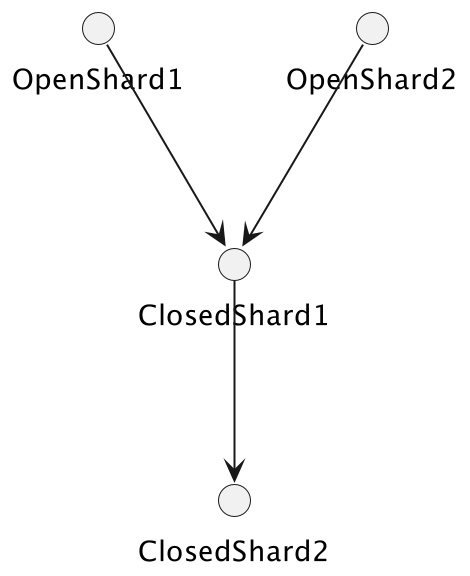

# 
> Amrith Kumar

## How bigg is DDB 
(picture)

## How does DDB scale a table(or GSI)? Are there limits to scalability?

## How does On-Demand really work?
* GAC
  * highly distributed rate limiting system

## Problem - Highly variable workloads
- shopping 과 같은 순간적으로 spike 치는 경우 어떻게 할 것인가?
- Small bursts에도 capacity management 필요 없음(2x)
- Large burst(over 2x)
  - may result in throttling during scale-out

## best practice
- [DEFAULT] On-Demand
- Provisioned
  - well understood, predictable, rigorously forecast, limited variability

## DDB transactions
### Isolation Guarantees
- standard ACID transaction support
- Isolation Guarantee
  - Other transactions
  - individual read and write operations

### Why DDB does not support begin-end transaction
- RDB의 multi request transaction은 DDB의 single request single request로 가능하다
- how
  1. separate the reads and the writes
  2. do all the reads
  3. constrcut single-request transaction
     4. all the writes
     5. include check conditions for invariants

### write failure management
* Problem
  * application calls transactWriteItems()
  * client가 보내다가 죽었다면
* solution
  * ddb transactions are idempotent
  * retry within 10 min using the same client request token
* pro tip
  * consider using a determine....?

## Replica
### EVOLUTION
* log 통해서 replica를 eventually consistency로 유지함
* log는 s3에 보관

### DDB streams
* stream은 별도의 interface(router)가 있고
* s3의 log를 통해 재연됨
* ordering과 exactly once를 guarantees

### Shard lineage
* closed share : has endseq
* open shard : hasnt endseq
* open shard -> closed ahrd
* load balacing을 shard의 rotation 통해서 함
* scalability 는 splitting을 통해서 함
* **Caveats and Warnings**

## DDB의 conflict strategies
* last writer is correct
* replication을 위한 별도의 replicator가 존재함

> 핵심은 aws time sync service

> Limitelss aurora vs DDB
> 
> 뭔가 대단한걸 만들고 유치원생에게 설명하는 느낌
> 
> 내용도 그정도 깊이 밖에 안되는거 같은데..이딴게 deep-dive?
> 
> how to use dynamo db (BEGINNER)로 제목을 바꾸는게 어떨지
> 
> 뒤에는 좀.. 괜찮네 
> 
> 아 교수같은 느낌 그거임