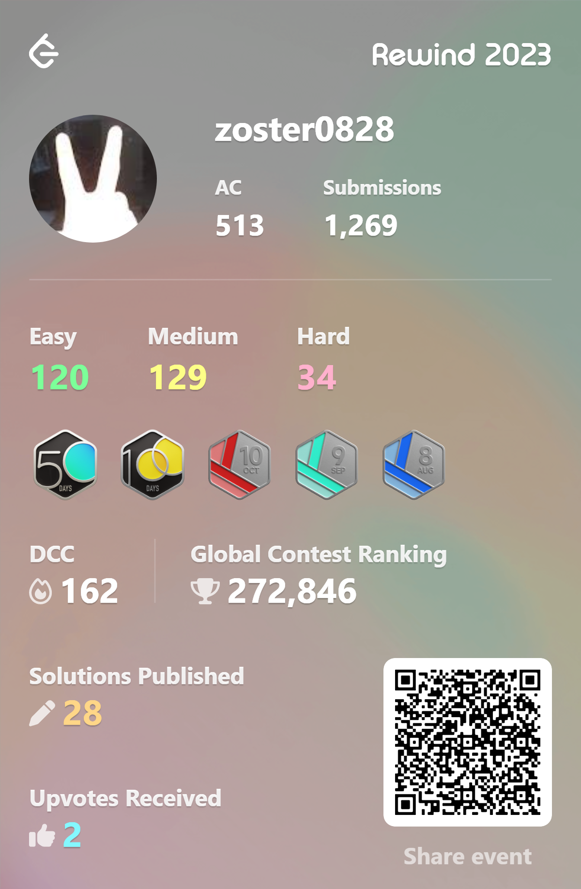
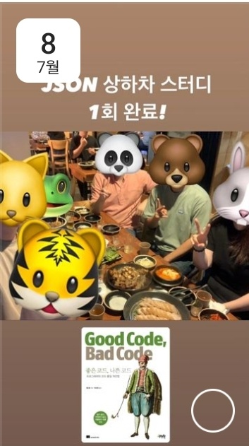
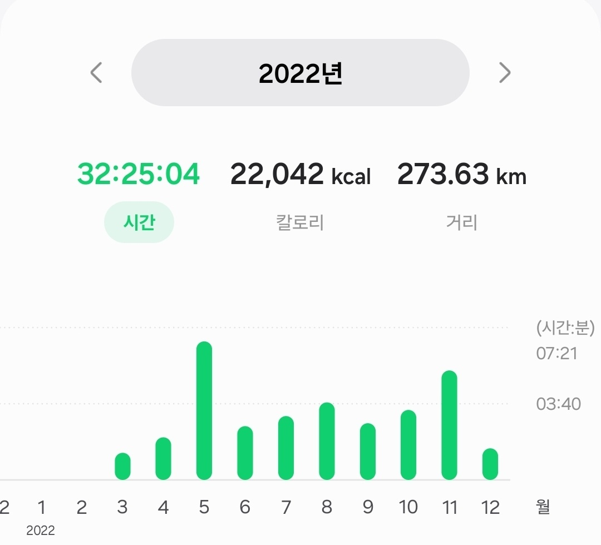
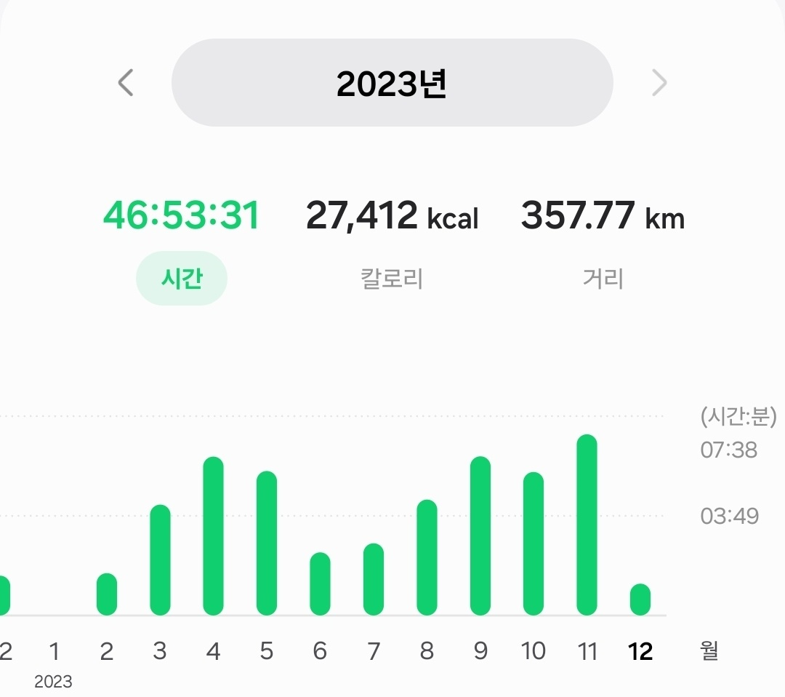

# 2023 기년회

## 팀적으로는
* `거대한 진흙 공`을 해체하는데 중점을 둔 해가 아니었나 싶다
    * 기술 부채를 많이, 엄청 많이 제거했고 내년에는 뛸 수 있는 준비가 됐다
* 우리가 global top tier에 비해 10년 정도 기술적으로 뒤쳐져 있다는 얘길 몇번 했는데
    * 내년 회고때는 조금 생각이 다를 수 있지 않을까 기대됨
* 가지고 있는걸 그룹내에 조금 더 많이 공유해도 될 것 같다
* 내가 올해 했던 것들을 팀원 분들이 하도록 할 생각

> ## 감사
> * 한해동안 함께 스터디했던 json 상하차 스터디 그룹에 무한한 감사를 드린다
> * study 하면서 개발적인 부분을 많이 배우고 성장하기도 했지만 꾸준한 공부를 할 수 있었던 가장 큰 원동력이 되었다고 생각한다
> * 개인적으로 올 한해 가장 잘한 일 중 하나로 꼽고 싶다
 

## 개인적으로는
### 2022 기년회에서 목표로 했던 것

* 업무적으로 보면 BR 교육을 들은뒤로 내실도 중요하지만 숫자로 드러내서 
* 외부에 보여질 수 있는 가치들을 만드는것이
  동기부여에 매우 중요하다 생각했다.
    * 예를들면 BR 자격, 특허, MX SW Awards, stack overflow, lndhub 활동..과 같은
    * 어느정도 성과를 거둔 부분도 있지만 꾸준히 하다보면 더 큰 뭔가가 되지 않을까 기대해보고 있다.
* 개인적으로는 10km 45분을 목표로 하고 있다.

### 그래서 올해는 이런걸 해봤다.

### Leetcode

### 스터디
**내부**
* Clean code
* 쉽게 시작하는 쿠버네티스
* webinar study

**json 상하차 study**
* 가상 면접 사례로 배우는 대규모 시스템 설계 기초
* 진화적 아키텍처
* 좋은 코드, 나쁜 코드
* (+) 스터디 30여회?

**개인**
* GoF의 디자인 패턴
* Clean architecture

### Commit
* 2020 : 1,320 (review : 37%, pr : 9%)
* 2021 : 1,498 (review : 25%, pr : 13%)
* 2022 : 4,038 (review : 24%, pr : 14%)
* 2023 : 3,856 (review : 19%, pr : 14%)
  * 리딩을 하면서 개발을 하다보니 review 비중이 좀 낮아진 것이 아쉽다
  * 내년에는 리뷰 비중을 30%까지 늘리는 것도 목표로 해봐도 좋을 것 같다
### Conference / Webinar
* GoogleCloud summit
* AWS re:invent
---

### 그래서 어땠는지?
* 객관적으로 내 실력, 수준을 돌아볼 수 있는 시간이 되었다
    * 어떤 부분이 부족한지, 어떤 부분이 좋은지 알 수 있었다
    * 특히 json 상하차 스터디에서 많은것을 배우고 측정할 수 있었다
* 막연하게 느껴졌던 성장의 방향성이 구체적으로 보였다
* 그러나 목표했던 구체적인 형태의 성장의 지표를 볼수는 없었다
* 그리고 어떤 구체적인 형태의 지표들을 만들어 내기에 올해초는 사실은 조금 부족한 수준이었을 것 같다
    * 지금은 어느정도 준비가 된 것 같다
* 
* 
    * 2022년에 비해 훨씬 많은 거리를 뛰었다.
    * 라스베가스에서도 다같이 달렸었는데, 달리기는 혼자 할때 더 자유로운 기분
    * 다만 기록적으로는 특별히 좋아진점은 없었고, 10km를 뛸 수 있는 상태는 되었다

### 내년에는
* 개발자는 운동선수나 힙합가수와 비슷한 맥락이 있다고 생각하는데, 그런면에서 기본기를 조금 더 확인하고 업그레이드 하는 해였고, 어느정도 목표를 이뤘다고 생각한다
    * 기본적인 랩스킬, 트렌디함을 가지는것도 좋지만 결국 최종 목표는 음원성적을 내기 위해 노력하듯이
    * 기본적인 코딩 스킬, 아키텍처의 트렌디함을 이해하고 따라가는데엔 성공한 것 같다
    * 음원성적(성과)를 만들어내기 위한 해가 되어야 할것 같다
* 구체적인 방향성은 생각해둔게 있는데 쉽지 않을것 같고 적어두면 내년에 다시 봤을때 초라해보일까봐 ㅎㅎ
> * 멘토링
> * 컨텐츠 제작
> * 사이드 프로젝트
> * 그룹내 새로운 아키텍처 설계 방식의 전파
> * LLM 상하차