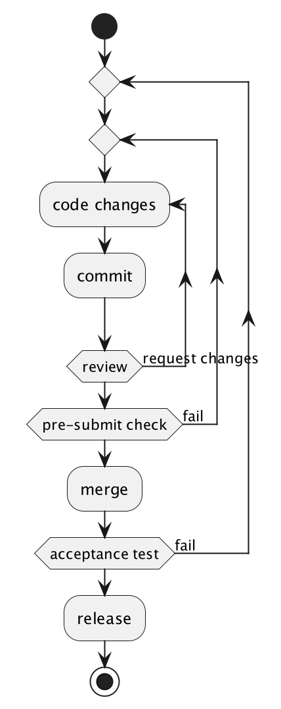
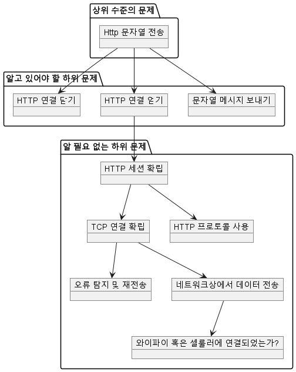

# 1. 코드 품질
### 코드 품질이 중요한 이유
|   | 고품질 코드 | 저품질 코드 |
|---|---|---|
| 최초 요구 사항 | 완전하게 충족 | 경계 조건을 처리하지 못하기 때문에 완전하게 충족하지 못함 |
| 요구 사항 변화 | 사소한 추가 작업 필요 | 대규모의 코드 변경 및 리팩터링 필요 |
| 오류 발생 시 | 시스템이 복구되거나 부분적으로 작동 | 시스템은 미리 정의되지 않은 상태에 놓이고 데이터는 손상될 가능성이 있음 |
| 처음 접하는 상황 | 명백히 예상되지 않은 상황도 처리 | 시스템은 미리 정의되지 않은 상태에 놓이고 데이터는 손상될 가능성이 있음 |
| 시스템 공격 | 시스템은 안전한 상태이고 손상되지 않음 | 시스템은 미리 정의되지 않은 상태에 놓이고 손상될 가능성이 있음 |
| 결론 | 신뢰할 수 있고, 유지보수가 쉬우며 버그가 거의 없는 소프트웨어 | 신뢰할 수 없고 유지보수가 어려우며 버그가 많은 소프트웨어 | 

* 소프트웨어 개발 및 배포 프로세스



### 고품질의 코드가 이루고자 하는 네 가지 목표
1. 작동해야 하고
1. 작동이 멈추지 않고
1. 변화하는 요구 사항에 적응할 수 있고
   1. 요구 사항을 모두 만족해서 시장에 늦게 나가거나
   1. 일단 만들어서 시장에 나갔으나 초기 피드백 대응후 시장에 늦게 나가거나
1. 중복 기능을 만들 필요가 없다.
   1. 이미 잘 만들어져 있다면

### 고품질 코드 작성을 위한 높은 수준에서의 여섯 가지 전략
  1. 코드는 읽기 쉬워야 한다 : 무슨 일을 무엇을 가지고 어떻게 하면 뭐가 나오는지
  1. 코드는 예측 가능해야 한다 : 이름과 그에 대응하는 동작만 하자
  1. 코드를 오용하기 어렵게 만들라 :  인자 명확하고 필요한것만
  1. 코드를 모듈화하라 :  외부에 의존하지 않고 실행할 수 있도록
  1. 코드를 재사용 가능하고 일반화할 수 있게 작성하라.
     1. 드릴은 벽도 뚫고 바닥도 뚫고(재사용)
     1. 드릴은 뚫기도 하고 나사를 박기도 하고(일반화)
  1. 테스트가 용이한 코드를 작성하고, 제대로 테스트하라.
### 고품질 코드 작성은 일정을 지연시키는가?
* 초반에는 느릴 수 있으나 중장기적으로 보면 결국 더 빠른 경우가 많다.

# 2. 추상화 계층
### 깔끔한 추상화 계층을 통해 문제를 하위 문제로 세분화하는 방법
```java
HttpConnection connection = HttpConnection.connect("http://example.com/server");
connection.send("Hello server");
connection.close();
```
추상화 계층 위에서 보면 매우 간단한 코드이지만 내부에서는
1. 문자열 serialize
2. Http 프로토콜의 동작
3. TCP 연결
4. 네트워크 확인
5. 데이터 -> radio frequency로 변경
6. 데이터 전송 오류 및 수정

상위 수준의 문제는 단순히 "메시지를 보낸다" 하지만 실제로는 이러한 많은 동작들이 필요함.

상위 수준에서는 Http 프로토콜이 어떻게 구현되는지 알 필요 없게 분리되어 있다.



### 추상화 계층이 코드 품질의 요소를 달성하는 데 어떻게 도움이 되는지
* 가독성
  * 코드의 모든 세부 사항을 이해하긴 어렵지만 한번에 다뤄야 하는 층을 한두개로 제한함으로써 가독성을 올린다.
* 모듈화
  * 하위 문제에 대한 해결책을 명확하게 분할하여 구현 세부 사항이 외부로 노출되지 않도록 보장
* 재사용성 및 일반화성
  * 추상화 계층을 통해 하위 문제에 대한 해결책을 재사용 하기 용이함.
  * 문제가 적절하게 추상화 되면 해결책이 여러 상황에서 일반화될 수 있다.    
* 테스트 용이성
  * 추상화 계층은 테스트 해야 할 범위를 줄여주고 동작을 명확하게 한다.
### API 및 구현 세부 사항
* 코드 호출 시 볼 수 있는 것
  * public class, interface, method
  * name, arguments, return type
* 볼 수 없는 것
  * 구현 세부 사항
* API에서 공개할 것 외에는 모두 구현 세부 사항이다.
* 코드를 하나의 API라고 생각하면 추상화 계층을 나누는데 도움이 된다.
### 함수, 클래스 및 인터페이스를 사용해 코드를 추상화 계층으로 나누는 방법
* 함수
  * SRP 지키기
  * 함수의 이름을 명확하게
  * 문장으로 바꿔보자
* CLASS
  * line count < 300
  * cohesion이 높은 class
    * sequence
    * functional
  * separation of cohesion
    * tv와 게임기의 예
      * tv는 input을 display 해주는 interface
      * 게임기는 게임의 변화를 ouput
      * 사용자는 게임기의 output을 tv에 input으로 넣어 화면을 볼 수 있다.
      * tv를 더 크게 바꾸더라도 게임기에는 아무 변화가 없음.
* interface
  * 계층 사이를 뚜렷이 구분하는 방법 중 하나.
  * interface의 구현체가 하나뿐이어도 구현하는 경우
    * public api를 명확하게 보여줌
    * 알고보면 하나 더 필요할 수 있음
    * 테스트가 쉬워짐(mocking이 쉬워짐)
    * 하나의 클래스로 두개의 하위 문제 해결해 코드의 일반화 가능성을 높임
      * LinkedList는 List와 queue를 모두 구현한다.
    * 그러나 더 많은 작업과 코드의 복잡성이 증가할 수 있음.
* layer가 너무 얇을때의 문제
  * boiler plate로 인해 코드양 증가
  * 더 많은 depth
  
* 이 사실들은 모든 개발자가 알고 있지만 적용하지 못하는 경우가 많다.

# 3. 다른 개발자와 코드 계약
* 예측 가능한 코드와 오용하기 어렵게 만들기는 모두 다른 개발자와의 상호작용에서 유용하게 동작한다.
### 다른 개발자들이 코드와 어떻게 상호작용 하는지
* 자신에게 명백하다고 다른 사람에게도 명백하진 않다.
* 다른 개발자가 무의식중에 코드를 망가뜨릴 수 있다.
* 시간이 지나 본인의 코드도 기억하지 못한다. 
* 다른 사람(또는 미래의 자신)은 새로운 코드를 볼때
  * 함수 클래스 enum의 이름을 보고
  * 리턴타입, 매개변수를 보고
  * 문서 또는 주석을 읽고
  * 직접 문의하거나
  * 구현체를 읽어본다.
### 코드 계약과 코드 계약의 세부 조항
* 선결 조건 : input
* 사후 조건 : output
* 불변 사항 : ??
* 계약의 명확한 부분
  * 함수/ 클래스 이름
  * 인자
  * 반환
* 세부 사항
  * 주석과 문서
### 세부 조항을 최소화하는 것이 어떻게 오용과 예측을 벗어나는 코드를 예방하는 데 도움이 되는가
* 개발자가 세부 사항을 모두 알아야 한다면 (예를들어 호출 순서) 오용할 가능성이 크다. 제대로 동작하지 않는다.
* 잘못된 일은 처음부터 불가능하게 만든다.
### 세부 조항을 피할 수 없다면 체크와 어서션을 어떻게 사용할 수 있는가
* 컴파일 타임에 제약할 수 없다면 runtime에 에러를 발생시킨다.
  * 체크
    * if(null), if(true)등의 조건 사용
    * 컴파일 타임에 체크하는 것 보다는 약한 제약
    * 테스트나 개발 단계에서 발견할 수 있음.
      * 그러나 테스트 어려운 조건이거나
      * 예외 발생이 catch 되어 인식할 수 없을 수도 있음.
    * 체크가 많다면 세부 사항에 대한 고려를 다시 해봐야할 수 있음.
  * 어서션
    * 체크와 거의 동일하지만 컴파일되지 않음
    * 사용되는 경우
      * 성능
      * 심각한 수준의 문제가 아닌 경우 넘어가기 위해(?)