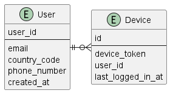

# 10장 알림 시스템 설계
> 알림 시스템은 push / sms / email로 분류할 수 있다

## 1단계 문제 이해 및 설계 범위 확정
* 적절한 질문을 통해 요구사항이 무엇인지 확인해야 함

* 지원해야 하는 알림 : push / sms / email
* 가능한 빨리, 약간의 지연 가능
* 알림 생성은  단말 모두 가능
* 알림을 받지 않도록 설정할 수 있음
* push 10,000,000 / sms 1,000,000 / email 5,000,000
> 해당 도메인에 대한 이해가 없을때 '적절한' 질문을 할 수 있는 방법이 있을까?

## 2단계 개략적 설계안 제시 및 동의 구하기
### 알림 유형별 지원 방안
* IOS / ANDROID / SMS / EMAIL
* 각각의 3rd party 이용하여 호출

### 연락처 정보 수집 절차
* 알림을 위해서는 단말 토큰 , 전화번호 , 이메일 주소 필요
* 최초 진입시 사용자의 정보를 db에 저장

* 한 사용자가 여러 단말을 가질 수 있고, 알림은 모든 단말에 전송되어야 함

### 알림 전송 및 수신 절차
* N개의 서비스가 알림 시스템을 호출
* 알림 시스템은 각 알림을 3rd party에 전달
* 3rd party가 각 단말로 전달하는데, 확장성을 유의해야함
  * 3rd party는 추가 또는 제거가 용이해야 함
* 각 단말에서 알림을 수신

* 이 설계의 문제점
  * 알림 시스템이 SPOF가 됨
  * 규모 확장에 용이하지 않음
---
그래서
* 알림 서버를 데인터베이스와 캐시를 사용하도록 변경
* 알림 서버가 증설이 용히자도록 함
* 푸시를 보내는 서비스는 QUEUE를 활용하여 exactly once를 보장하고 강결합을 끊는다

* 알림 서버의 기능
  * 알림 전송 API : 인증
  * 알림 검증 : target에 대한 검증
  * db / cache query
  * 알림을 queue에 넣는다

## 3단계 상세 설계
### 안정성
* 데이터 손실 방지 : 지연이나 순서의 오동작은 괜찮지만, 유실은 안된다
  * 이를 위해 알림을 수행했는지에 대한 로깅을 위한 db 사용
* 중복 전송 방지
  * 알림을 전송하기 직전에 발송된 이벤트인지 한번 확인
  * 불가능한 이유 : https://bravenewgeek.com/you-cannot-have-exactly-once-delivery/
    * at-most-once, at-least-once, exact-once
      * 최대 한번 : 한번만 보내고 더 이상 보내지 않음
      * 최소 한번 : 도착을 확인할때까지 보냄
      * 정확히 한번 : 받은쪽의 응답이 유실될 수 있음, 보낸쪽의 응답이 유실될 수 있음. 두가지중 어떤것인지 알 방법이 없음

> 알림 템플릿은 서버에서 제공하는게 맞는지 : 데이터 전송량을 줄이기 위함

### 푸시 알림과 보안
* 인증키를 사용하여 알림을 보낼 수 있도록 제한
### 큐 모니터링
* 큐에 쌓인 알람이 많아지면 자동 증설 또는 관리자에게 알림을 보낸다
### 이벤트 추적
* 알림 확인율, 클릭율, 앱 진입과 같은 메트릭은 알림을 보낼때 빈도에 대한 중요한 정보를 제공함
### 최종 설계안
* 알림 서버에 인증과 전송률 제한 기능 추가
* 전송 실패 대응 위한 재시도 기능 추가
* 전송 템플릿을 사용, 알림 생성 과정 단순화, 일관성 유지
* 모니터링 및 추적 시스템 추가, 시스템 상태 확인 및 개선 가능하게

## 4단계 마무리
* 안정성 : 메시지 전송 실패율 낮추기 위한 안정적 재시도 메커니즘 도입
* 보안
* 이벤트 추적 및 모니터링 : 알림의 전달 과정을 추적하고 모니터링할 수 있는 시스템
* 사용자 설정 : 사용자는 푸시 알림을 받지 않을 수 있다
* 전송률 제한 : 사용자에게 알림을 보내는 빈도를 제한