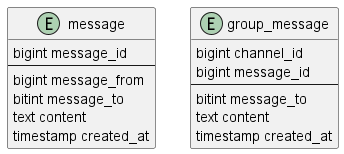

# 12장 채팅 시스템 설계
## 1단계 문제 이해 및 설계 범위 확정
* 1:1 및 그룹 채팅 지원
* 모바일/웹 지원
* DAU 5천만
* 그룹 최대 100명
* 사용자 접속상태 표시
* 메시지 길이는 100,000자 이하
* e2ee X
* 메시지 보관기한 : 영구

## 2단계 개략적 설계안 제시 및 동의 구하기
* 클라이언트의 메시지 수신
* 메시지 수신자 결정 및 전달
* 수신자가 OFFLINE 일때 접속까지 메시지 보관

### 통신 프로토콜
* 기본적으로 HTTP를 사용하지만 수신은 HTTP 사용보다는 WEB SOCKET이 좋음
* Polling
  * 주기적으로 클라이언트가 새 메시지 있는지 물어봄
  * 메시지 없는 경우 서버 자원 낭비됨
* long polling
  * polling의 문제 해소하기 위해 나옴(push의 동작 방식)
  * 서버에서 polling을 대기
  * connection pool 갯수의 문제가 있음
  * 같은 서버에 두 클라이언트가 붙지 않을 수 있음
  * 클라이언트의 연결이 유효한지 아닌지 알 방법이 없음
* web socket
  * 영구한 한번의 양방향 연결
  
> upbit 분석 시 candle이 websocket으로 들어오는 것 본 적 있음
### 개략적 설계안
* 무상태 서비스는 lb 뒤에 위치, 서비스탐색, 인증, 그룹관리, 사용자 profile등
* 상태 유지 서비스
  * 채팅 서비스는 상태 유지 필요, 서비스 탐색 서비스 통해서 서버를 분산해준다
* 규모 확장성
  * 채팅 서버는 클라이언트 사이에 메시지를 중계
  * 접속상태 서버는 사용자의 접속 여부 관리
  * API 서버는 로그인, 회원가입, 프로파일등 유저의 관리
  * 알림 서버는 푸시 알림
  * K-V 저장소는 채팅 이력을 보관
* 저장소
  * 일반적인 데이터는 rdb에 보관한다
  * 채팅 기록은 kv 저장소에 보관한다
    * 데이터의 양이 매우 많고(fb/ whatsapp은 일 600억 메시지 처리)
    * 가장 빈번한 데이터는 최근 메시지
    * 가끔 검색 등으로 특정 메시지로 점프 하는 경우도 있음
    * 읽기 : 쓰기 비율은 1:1
    * kv 저장소는 규모확장이 쉬우며 latency가 낮음, rdb는 long tail을 잘 처리하지 못한다
    * 인덱스가 커지면 데이터 처리 비용이 늘어남
* 데이터 모델
  * 
  * 1:1 채팅을 위한 메시지 테이블
    * pk를 이용해 메시지 순서를 정리한다
  * 그룹 채팅을 위한 메시지 테이블
    * channel_id, message_id composite key 사용
    * channel은 그룹의 의미, channel id를 partition key로 사용
      * partition key : nosql에서 특정 partition을 사용하기 위한 key로 table의 개념으로도 사용할 수 있으나 더 가벼움
## 3단계 상세 설계
### 서비스 탐색
* 서비스 탐색의 주 역할은 클라이언트에게 적절한 서버를 추천하는 것
* 클라이언트의 위치, 서버의 capa등 고려
* zookeeper 사용할 수 있음(kafka에서 사용)

### 메시지 흐름
* 1:1 채팅의 메시지 흐름
  * 사용자A가 채팅서버로 메시지를 보낸다
  * 채팅 서버에서 ID를 생성
  * 메시지를 동기화 큐로 전송
  * 메시지가 KV 저장소에 저장되고
  * 접속중이 아니라면 PUSH를 보내고
  * 접속중이라면 채팅 서버2로 보낸다
* 여러 단말 사이의 메시지 동기화
  * 두개의 단말간의 SYNC는 last message를 기준으로 kv 저장소에서 읽어온다
* 소규모 그룹 채팅에서의 메시지 흐름
  * 1:1과 기본적으로 동일, 메시지 큐를 각 사용자별로 분리하여 가지고 각 큐로 메시지를 복사하여 보낸다
  * 그룹이 크면 복사하는 작업의 비용이 문제가 될 수 있음
### 접속상태 표시
* 접속 상태 표시는 websocket 으로 통신
* 사용자 로그인 시 접속상태 서버로 접속했음을 알리고, kv 저장소에 last active 시간을 기록한다
* 사용자 로그아웃 시 kv 저장소에 보관된 사용자 상태가 offline으로 변경된다
* 접속 장애
  * 접속이 원할하지 않은 경우 반복해서 접속 상태가 변경될 가능성이 있고 사용자가 알리지 않고 떠났을 경우 알 수 없다
  * heartbeat 통해 client에서 서버로 현재 접속중임을 알린다
  * 일정 시간이 지나도 heartbeat이 오지 않으면 offline으로 간주한다
* 상태 정보를 모든 친구관계에 있는 사용자에게 전송할 수 없다
  * queue를 두어 접속상태를 알릴때 친구가 많은 경우 queue가 그 만큼 늘어나게됨
  * 따라서 접속상태는 특정 상황에서만 조회하도록 유도할 필요가 있다

## 4단계 마무리
* 비디오나 미디어는 어떻게 지원할 있을지 고민해보자
  * 채팅 서비스의 설계와는 사실 별개로 느껴지긴 함, media file 처리 서버의 역할
  * 채팅 서비스에서는 처리된 media file 서버를 사용하기만 하면 되지 않을까
* e2ee 처리
* 캐시 : 클라이언트에서 읽은 메시지를 캐싱하여 서버의 부하를 줄일 수 있다
* 로딩 속도 개선을 위해 country를 설정하여 지역적으로 분산할 수 있다
* 오류 처리
  * 채팅 서버 오류 : 채팅 서버 하나가 죽으면 수십만 사용자가 접속해 있다가 전부 실패할 수 있다
    * 빠르게 새로운 서버로 배정하여 다시 접속할 수 있도록 하자
  * 메시지 재전송 : 재시도나 큐는 메시지의 안정적 전송을 보장하기 위해 많이 사용하는 기법이다

---
상하차 스터디 토크

### DLQ는 어떻게 만들어서 관리하시는지?
* 저는 각 토픽마다 DLQ를 별도로 만들어서 관리하는데 KAFKA에 토픽이 2K개를 넘지 않는게 좋다는 이야기를 들었다
* 토스에서는 실제로 이 문제로 KAFKA가 터진 경우도 있다고 함
* 그래서 하나의 dlq를 쓰는 방향으로 변경하려고 하고 있음
* https://www.quora.com/Is-there-any-limit-on-the-number-of-topics-in-Kafka?share=1
* KAFKA의 TOPIC 갯수 문제는 zookeeper의 partitioning 문제로, 현재 kafka에는 없을수도 있음