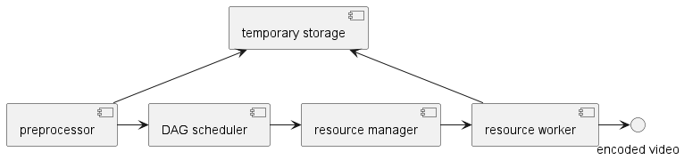

# 14장 유튜브 설계
* youtube stat
  * MAU 20억
  * 일간 비디오 재생 수  50억
  * 미국 성인 73% 이용
  * 업로더 5천만
  * 광고 수입 19년 기준 150억 달러
  * 모바일 트래픽의 37% 점유
  * 80개 언어 이용 가능

## 1단계 문제 이해 및 설계 범위 확정
* 비디오 업로드 및 시청 기능
* 모바일, 웹, TV 지원
* 500만 DAU
* 다국어 지원
* 모든 비디오와 해상도 지원
* 암호화 필요
* 비디오 크기는 최대 1GB
* 클라우드 서비스 이용 가능

### 개략적 규모 추정
* 가정 
  * 500만 사용자가 평균 5개 영상 시청
  * 그중 10%가 영상 업로드
  * 비디오의 크기는 평균 300MB
  * 비디오 저장 : 50만 * 300MB : 150TB
  * CDN 비용
    * CloudFront 기준 1GB당 $0.02
    * 500만 * 5* 0.3GB * 0.02 : $150,000
    * 비용이 너무 큼

## 2단계 개략적 설계안 제시 및 동의 구하기
* BLOB 저장소부터 설계하는 것은 시간안에 설계를 마칠 수 없다

### 비디오 업로드 절차
* Metadata db : 비디오의 metadata 보관
* Metadata cache : 비디오와 사용자 정보를 caching
* transcoding server : 비디오의 포맷을 변환해 대역폭, 단말에 맞는 스트림을 제공할 수 있게 한다
* transcoded stroage : transcoding 된 비디오 저장
* transcoding 완료 큐 : 완료 이벤트 보관
* completion handler : 완료 큐에서 데이터 꺼내어 meta를 갱신한다

### process A : 비디오 업로드 시나리오
1. 비디오를 원본 저장소에 업로드
2. transcoding server는 비디오를 가지고 와서 transcoding 시작
   3. 여기서도 queue를 쓰면 좋을것 같음
4. 트랜스코딩이 완료되면 아래 절차를 병렬 수행
   5. 완료된 비디오를 transcoded storage로 저장
   6. completion handler가 이벤트를 poll하고 갱신한다
7. api서버가 단말에 스트리밍 준비되었음을 알린다

### process B : 메타 갱신
* 업로드 되는 동안 전달받은 메타데이터를 캐시와 db에 업데이트 한다.

### 비디오 스트리밍 절차
* 스트리밍 프로토콜을 이용하여 전송
  * 전체를 받을 필요 없고 part만 받아 재생할 수 있다
* MPEG-DASH
* APPLE HLS - *
* MS Smooth streaming
* Adobe HTTP Dynamic Streaming(HDS)

## 3단계 상세 설계
### 비디오 트랜스코딩 하는 이유
* 원본은 사이즈가 너무 큼
* 지원하는 비디오 포맷이 단말별로 다름, 여러 형태로 인코딩 해두어야 함
* 대역폭에 따라 다른 화질을 제공할 수 있어야 함
  * 불안정한 네트워크인 경우 가변

### DAG 모델
* 페이스북에서 도입, 작업을 단계별로 배열하여 병렬 실행될 수 있도록 함
  * 비디오 / 오디오 / 메타데이터로 분리
* 비디오
  * 검사 : 비디오의 손상이 없는지 검사
  * 인코딩 : 여러 해상도 코덱 비트레이트로 인코딩
  * 섬네일 생성
  * 워터마크 추가
### 비디오 트랜스코딩 아키텍처

* preprocessor
  * 비디오 분할, GOP로 쪼갠다.
    * 오래된 단말이 GOP 처리를 하지 않으면 preprocessor가 대신 수행
  * DAG 생성 : 설정 파일에 따라 DAG 생성
  * 데이터 캐시 : GOP와 메타를 임시 저장소에 보관한다, 실패시 TEMP를 이용해 재개한다
* DAG scheduler
  * 단계로 분할후 resource manager의 큐에 넣는다
* resource manager
  * resource 배분을 수행
  * 작업 큐 : 작업에 대한 우선순위 큐
  * 작업 서버 큐 : 작업 서버의 상태 정보
  * 실행 큐 : 현재 실행중인 작업과 서버 정보
  * 작업 스케쥴러 : 최적의 작업과 서버를 골라 작업을 지시
### 시스템 최적화
* 속도 최적화 
  * GOP로 분할된 영상의 병렬 처리, 속도, 재수행 면에서 이점이 있음
  * EDGE 서버 사용
  * 작업 절차의 병렬화 (Event driven 매우 적합)
* 안정성 최적화
  * pre signed url
  * 비디오 보호 
    * DRM 관리
    * AS 암호화
    * 워터마크
* 비용 최적화
  * CDN은 매우 비싸다!
    * 인기 비디오는 CDN 사용하고 일반 비디오는 서버 통해 제공
    * 인기가 별로 없는 영상은 인코딩을 하지 않거나, 짧은 경우 on demand 처리 한다.
    * 지역별 CDN에 지역에서 인기 많은 영상만 둔다
      * Q : 재생 안하면 어차피 똑같지 않나
    * CDN을 직접 구축한다....
### 오류 처리
* 회복 가능 오류와 불가능 오류로 분리하여 케이스별로 나누어 오류를 처리하자

## 4단계 마무리
* 라이브 스트리밍, 유사한 점이 많지만 차이점이 있다
  * 응답지연을 더 낮게 설계해야 한다
  * 병렬화는 요구사항이 낮다
  * 오류 처리는 실시간성이 요구된다
* 비디오 삭제 처리 어떻게 할 것인가
  * 요청에 의한 삭제가 있을 수 있다
  * 유튜브 기준으로 저작권자 40% 업로드 60% 승리하고
  * 저작권자의 90%는 삭제보다 수익화를 선택함
