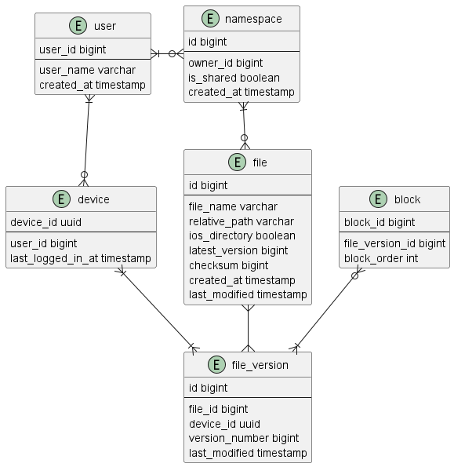
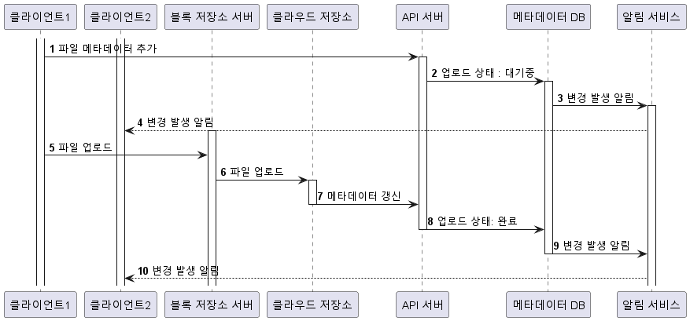
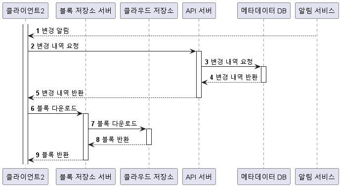

# 15장 구글 드라이브 설계
## 1단계 문제 이해 및 설계 범위 확정
* 파일 업로드/다운로드, 동기화, 알림
* 모바일 / 웹 지원
* 암호화해야함
* 파일크기 10GB 제한
* DAU 천만

### 개략적 추정치
* 가입 사용자 5천만, DAU 천만
* 10GB 무료 플랜
* 매일 사용자가 평균 2개 업로드, 평균 500kb
* 읽기:쓰기 비율은 1:1
  * 실제로는 100:1도 안될것 같음
* 필요한 저장공간 : 5천만 * 10gb : 500 PB
* 업로드 API : 1천만 * 2회 / 86400 : 240 qps
* 최대 480 qps

## 2단계 개략적 설계안 제시 및 동의 구하기
* 모든 것을 담은 하나의 서버에서 출발해 점진적으로 발전시켜 나가자
* 파일을 업/다운 하는 웹 서버
* 사용자 데이터, 로그인, 파일 등의 메타를 저장한 db
* 파일을 저장할 저장소, 1TB DISK

### API
* 파일 업로드 API
  * 기본 업로드
  * 이어 올리기
* 파일 다운로드 API
* 파일 갱신 히스토리 API
### 한대 서버의 제약 극복
* DISK가 가득차면 더이상 서비스를 할 수 없게 된다
* User id를 기준으로 샤딩하여 분할 저장한다
  * 데이터를 유실할 가능성이 불안하다
  * S3를 사용하자
* LB를 붙이고 메타DB를 파일 저장 서버에서 분리한다

### 동기화 충돌
* 사용자 2명이 같은 파일에 접근했을때
  * CAS
    * 이전 버전을 기반으로 변경했는지 체크
  * TIMESTAMP
    * 현재 버전보다 TIMESTAMP가 최신인 버전 우선
  * MERGE
    * 사용자가 수동 MERGE
### 개략적 설계안
* 사용자 단말 : 사용자가 이용하는 클라이언트
* 블록 저장소 서버 : 파일 블록을 저장하는 서버. 클라우드 환경에서 파일을 여러 블록으로 독립적인 객체로 저장된다
* 클라우드 저장소 : 블록 저장소 서버에서 전송된 파일을 블록 단위로 저장한다
* 아카이빙 저장소 : 오랫동안 사용되지 않는 데이터를 저장
* 메타 db : 메타데이터를 저장한다
* 알림 서비스 : 파일의 최신 상태를 확인
* 오프라인 사용자 백업 큐 : 클라이언트가 접속중이 아닐때 큐에 두고 접속했을때 동기화 되도록 한다
  * 5천만개의 큐를 가지고 있는것?

## 3단계 상세 설계
### 블록 저장소 서버
* 정기적으로 갱신되는 큰 파일들은 업데이트가 일어날 때마다 전체 파일을 서버로 보내면 대역폭을 많이 사용하게 된다
  * 델타 동기화 : 수정된 블럭만큼만 동기화
  * 압축 : 전송량을 줄일 수 있다
### 높은 일관성 요구사항
* NOSQL은 ACID를 지원하지 않으므로 동기화 로직안에 프로그램을 넣어야 한다

### 메타데이터 DB

* user : 사용자 정보
* device : 단말 정보, 한 사용자가 여러대의 단말
* namespace : 사용자의 루트 directory 정보
* file : file의 최신 정보
* file_version : 파일의 갱신 이력
* block : 파일 블록에 대한 정보

### 업로드 절차

### 다운로드 절차

### 알림 서비스
* 채팅과는 달리 양방향 통신 필요하지 않음
* 웹 소켓은 양방향 통신의 요구사항을 처리할 수 있고 long polling 보다 많은 자원을 소모

### 저장소 공간 절약
* hash를 통한 중복 제거
* 보관할 백업 버전 갯수 제한
* 중요한 버전만 보관
* 자주 쓰이지 않는 데이터 cold storage로 보냄
  * cold storage는 복원이 비싸고 느리기 때문에 잘 선정해야 함

## 4단계 마무리
* 서버를 거치지 않고 업로드를 허용할 경우
  * 클라이언트가 해킹될 위험
  * 로직을 플랫폼에 맞게 단말에서 구현해야 함