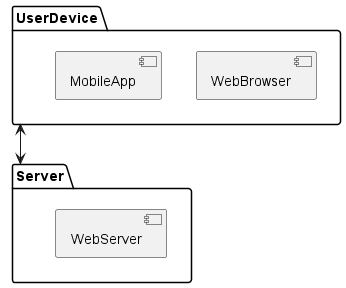
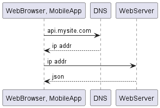
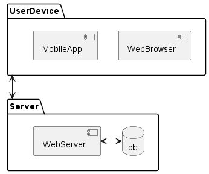
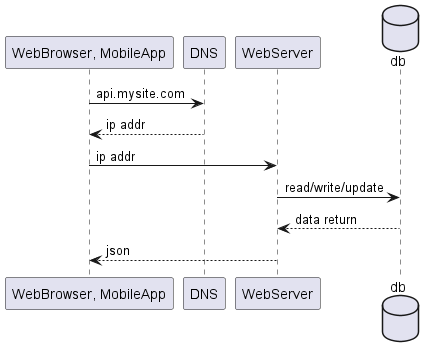
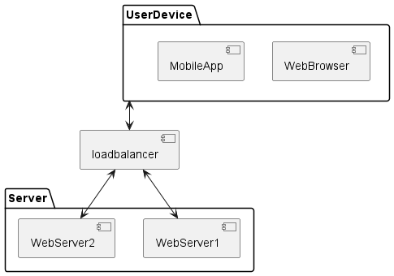

# 1장. 사용자 수에 따른 규모 확장성
## 단일 서버
* 웹, 앱, 데이터베이스, 캐시 등이 전부 서버 한대에서 실행되는 예제

**구성은 아래와 같다**

**sequence는 아래와 같다**

## 데이터 베이스
* 사용자가 늘면 서버를 여러개로 분리해야 한다
* 트래픽 처리를 위한 webserver와 저장을 위한 database로 분리한다
> data의 영속성 처리를 쉽게 하기 위해서나, 여러대의 webserver에서 consistency 관리를 위해서 아닌가?

**구성은 아래와 같다**

**sequence는 아래와 같다**

* database에는 두종류가 있다. RDB / NOSQL
* RDB는 데이터의 JOIN이 가능하고 정형화된 데이터를 넣을 수 있다.
* NOSQL은 일반적으로 JOIN 미지원
  * KV-STORE(dynamo), GRAPH(neo4j), COLUMN(cassandra), DOCUMENT(mongodb, couchbase)

## Scale-up vs Scale-out
* Scale-up : VM의 크기 자체를 키움, memory up, cpu up
  * 단순함
  * 확장에 한계가 있음
  * failover / redundacuy 방안 없음
* Scale-out : VM의 댓수를 늘린다

* LoadBalancer 통한 Scale-out

* Web 계층은 분산처리가 되었으나 database는?

* 성능 : write / read 분리
* 안정성 : 일부 파괴되어도 데이터 보존
* 가용성 : 장애 발생하더라도 서비스 가능

* sub shutdown 시 main으로 read도 전환
  * sub가 여러대라면 다른sub로 분산
  * sub가 한대였다면 main으로 장애 전파될 위험 있음
* main shutdown 시 sub가 main으로 전환
  * sub가 여러대라면 문제 없음
  * sub가 하나라면 마찬가지로 main으로 전환되고 장애 전파될 위험 있음
> sub 여러개일때 복제위한 traffic은 어떻게 처리되는가?

