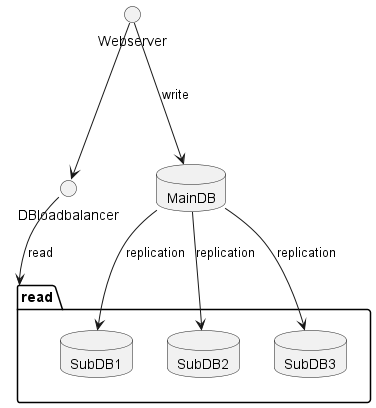
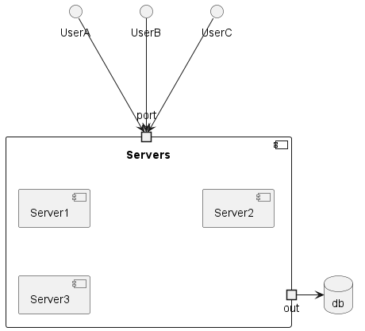

# 1장. 사용자 수에 따른 규모 확장성
## 단일 서버
* 웹, 앱, 데이터베이스, 캐시 등이 전부 서버 한대에서 실행되는 예제

**구성은 아래와 같다**

**sequence는 아래와 같다**

## 데이터 베이스
* 사용자가 늘면 서버를 여러개로 분리해야 한다
* 트래픽 처리를 위한 webserver와 저장을 위한 database로 분리한다
> data의 영속성 처리를 쉽게 하기 위해서나, 여러대의 webserver에서 consistency 관리를 위해서 아닌가?

**구성은 아래와 같다**

**sequence는 아래와 같다**

* database에는 두종류가 있다. RDB / NOSQL
* RDB는 데이터의 JOIN이 가능하고 정형화된 데이터를 넣을 수 있다.
* NOSQL은 일반적으로 JOIN 미지원
  * KV-STORE(dynamo), GRAPH(neo4j), COLUMN(cassandra), DOCUMENT(mongodb, couchbase)

## Scale-up vs Scale-out
* Scale-up : VM의 크기 자체를 키움, memory up, cpu up
  * 단순함
  * 확장에 한계가 있음
  * failover / redundacuy 방안 없음
* Scale-out : VM의 댓수를 늘린다

* LoadBalancer 통한 Scale-out

* Web 계층은 분산처리가 되었으나 database는?

* 성능 : write / read 분리
* 안정성 : 일부 파괴되어도 데이터 보존
* 가용성 : 장애 발생하더라도 서비스 가능

* sub shutdown 시 main으로 read도 전환
  * sub가 여러대라면 다른sub로 분산
  * sub가 한대였다면 main으로 장애 전파될 위험 있음
* main shutdown 시 sub가 main으로 전환
  * sub가 여러대라면 문제 없음
  * sub가 하나라면 마찬가지로 main으로 전환되고 장애 전파될 위험 있음
> sub 여러개일때 복제위한 traffic은 어떻게 처리되는가?

## 캐시
* 비싼 연산 또는 잦은 접근이 있는 데이터를 메모리에서 읽어온다
* 메모리에서 읽어오기때문에 데이터베이스보다 훨씬 빠름
* 캐시에 있으면 캐시에서, 없으면 db에서 읽어 캐시에 업데이트하고 반환
* 갱신은 잦지 않고 조회는 빈번한 경우
### 주의점
* 영속적 데이터는 캐시에 두는것이 바람직하지 않음
> redis?
* 만료 정책 필요, 삭제되지 않으면 갱신된 데이터가 업데이트 되지 않음, 너무 짧으면 캐쉬 효율 떨어짐
* consistency : db 업데이트와 캐시 업데이트가 단일 트랜잭션이 아니라면 깨질 수 있다
> 어느정도 희생하는게 맞지 않을까?
* 캐시 서버가 spof가 되지 않도록
* 메모리 크기로 인한 eviction 예측 필요
* eviction 정책
  * LRU, LFU, FIFO

## CDN
* binary cache
* 차이점은 CDN은 외부 사업자가 제공, 비용적 문제를 고려해야함
* CDN도 SPOF가 될 수 있음, 외부 사업자이므로 문제 있는 경우 즉시 원본 접근 가능한 설계
* 데이터 버저닝 통한 의도적 강제 접근

 

## stateless web layer
* Stateful

* UserA의 정보는 Server1에 UserB의 정보는 Server2에 ...

## 데이터 센터
* data center 2곳으로 분산한 모습은 아래와 같다

* 사용자는 기본적으로 가장 가까운 데이터 센터로 안내됨, geoDNS-routing이라고 부른다
* 한곳에 장애 발생시 트래픽은 장애 없는 센터로 이동된다

* 이와 같은 설계를 위해서는 몇가지 문제를 해결해야 함
  * 트래픽 우회, GeoDNS 이용해 가장 가까운 센터로 보내준다
  * 데이터 동기화 : 센터별 별도의 데이터를 사용한다면 장애가 복구되어 트래픽이 우회한다 해도 데이터가 없을 수 있다
    * 보편적으로는 센터별로 복제본을 두는 방법이 있다
  * 테스트와 배포 : 센터별로 테스트 가능해야 하고, 배포 도구 이용해 센터별 동일한 서비스가 배포되도록 해야 한다

## 메시지 큐
* 무손실, 비동기 통신을 지원하는 컴포넌트
* pub/sub
* 서비스 / 서버 간 loose coupling, 규모 확장성 좋음
  * 각자 가용 상태 아니라도 producing / consuming 할 수 있음
* 이미지 처리와 같은 시간이 오래 걸릴 수 있는 프로세스 처리에 좋다

## 로그, 메트릭 그리고 자동화
* 로그 : 에러 로그 모니터링은 중요, 서버 단위 모니터링보다 모아서 볼 있으면 좋음
* 메트릭, 일반적으로 아래 것들이 기본
  * host cpu, memory, disk i/o, network
  * cache hit율, database latency
  * DAU, Revernue, retention
* 자동화 : ci 툴, build, test, deployment

## 데이터베이스의 규모 확장
* 수직적 확장, 수평적 확장
* Scale-up
  * server와 동일한 이슈
* Sharding
  * Primary key % n를 활용한 샤딩이 보편적
  * resharding 어려움
    * 키 분산에 실패해 샤드가 소진 되는 경우
  * hotspot key : 특정 샤드에 과부하 걸리는 문제
    * ex) 특정 유명인사의 데이터가 몰려있다면?
  * join / de-normalization : 조인 어려움, 비정규화 통해 테이블 하나만 참조하도록
> 그럴거면 nosql이 낫지 않나?

## 백만 사용자, 그 이상
* stateless
* 다중화
* 캐싱
* multi data center
* CDN
* sharding
* service 분할
* 모니터링 및 자동화
