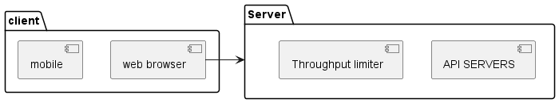
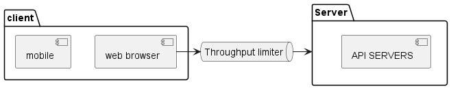
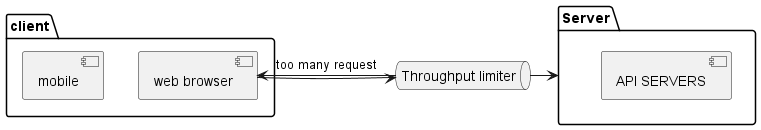

# 4장. 처리율 제한 장치의 설계
> API 요청 횟수가 제한 장치에 정의된 임계치를 넘어서면 이후 요청은 중단된다.

* DoS 공격에 의한 자원 고갈을 방지
* 비용 절감
* 서버의 과부하 방지

## 1단계 문제 이해 및 설계 범위 확정
* 처리율을 초과하는 요청은 제한
* 제한 장치는 응답시간에 영향을 적게 준다
* 메모리를 적게 사용
* 분산형
* 제한시 사용자에게 명시적으로 안내
* 제한 장치의 문제가 시스템에 영향을 주지 않음

## 2단계 개략적 설계안 제시 및 동의 구하기
* 처리율 제한 장치의 위치
  * 단말은 쉽게 위변조 가능하므로 서버에 둔다
    

[4-1]

[4-2]

[4-3]

* 일반적으로 API Gateway에서 구현됨
  * 처리율 제한
  * SSL termination
  * auth
  * whitelist 관리 등

> 처리율 제한을 실시간으로 제어할 수도 있지만 제한에 대한 비용이 큰 경우 로그를 통해 제한 할수도 있을 듯

## 처리율 제한 알고리즘
### 토큰 버킷 알고리즘(아마존, 스트라이프)

* 장점
  * 구현이 쉽다
  * 메모리를 적게 사용
  * burst 처리 가능
* 단점
  * 버킷 크기와 refiller의 튜닝 어려움
### 누출 버킷 알고리즘(shopify)

* 장점
  * 큐의 크기 제한으로 인해 메모리 사용량 효율 높음
  * 고정된 처리율로 인한 안정적 출력
* 단점
  * burst 요청의 처리가 어려움
  * 튜닝 어려움

### 고정 윈도 카운터 알고리즘
* 고정된 윈도우의 카운터를 초과하면 다음 윈도우까지 버린다.
* 경계에 집중될 경우 예상보다 더 많은 요청이 처리될 수 있음
* 장점
  * 메모리 효율 높음
  * 이해하기 쉬움
  * 특정 트래픽 패턴 처리에 적합
* 단점
  * 윈도우 경계의 트래픽이 예상과 다른 처리량을 가질 수 있음

### 이동 윈도 로깅 알고리즘
* 고정 윈도의 문제점을 해결하기 위함
* 새 요청의 타임스탬프부터 윈도우 사이즈를 계산

* 장점
  * 정교하게 동작
* 단점
  * 메모리 사용량 많음

### 이동 윈도 카운터 알고리즘
* 고정 + 이동 로깅
* 장점
  * 이전 시간대의 평균에 따라 계싼되므로 burst에도 대응 가능
  * 메모리 효율이 좋음
* 단점
  * 균등을 가정하기 때문에 추정치 계산에 느슨함
    * 다만 cloudflare의 실험에 따르면 0.003%에 불과한 오류가 있었다고 함

### 개략적인 아키텍처
* Redis와 같은 시스템을 이용하여 increase, expire를 이용해 count하고 한도에 도달하면 거부

## 상세 설계
* 