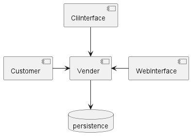
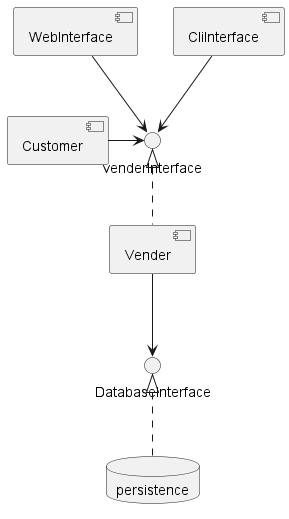

# 진화적 아키텍처의 함정과 안티패턴

## 8.1 기술 아키텍처
### 8.1.1 `안티패턴` 마지막 10%의 덫, 로우코드/노코드
* 고속 개발 도구를 목표로 설계된 프레임워크, 언어는 80% 까지는 매우 빠르게 개발할 수 있으나
* 90%를 위해선 우회를 해야했고
* 마지막 10%는 결코 도달할 수 없는 문제였다.
* 복잡성을 제거하고, 전방위적 기능을 지원하며, 예측 가능한 결과물을 표방하는 개발 환경은 주기적으로 소프트웨어 생태계에 등장한다
* 그러나 이것은 대개 마지막 10%의 덫을 만들어 내는 흐름이다
* 아키텍트는 일부 특수한 상황에서 이러한 도구를 고려할 수 있지만 그에 따른 한계를 사전에 인지하고 생태계에 어떤 영향을 미칠지 판단해야 한다
* 아키텍트는 도구의 기본 기능보다는 한계를 먼저 시험하고 한계에 대한 대비책을 구축해둬야 한다
> Study comment : c사는 cafe24로 만들어져 있었는데 front만 수정 가능하고 백엔드는 수정 불가능해서 
> 
> 아예 새로 만들었음. C사도 비슷한 것으로 알고 있음
### 8.1.2 `사례연구` PenultimateWidgets의 컴포넌트 재사용
* 팀에서는 특정 기능을 컴포넌트로 구현했다
* 시간이 지나며 컴포넌트팀은 고립되었으며 팀의 다른 개발자들은 컴포넌트팀에 발이 묶였다
  * > 왜 고립되었는지?
* 재사용 가능한 자산을 만드는 것은 중요하지만 이 자산이 가치를 만들고 있는지 지속적으로 평가해야 한다
  * > 컴포넌트화가 이익을 주지 않는 시점이 왔을때 어떻게 대응할 것인가
* 이러한 팀간의 커플링을(병목) 제거하기로 결정하고 신기능을 필요한 팀에서 포크해 직접 추가할 수 있게 변경했다
* 커플링 지점이 진화를 방해하거나 아키텍처 특성을 저해할 경우 커플링을 끊어야 한다
* 아키텍트는 아키텍처의 특성을 평가하며 지속적인 가치를 만들지 못한다면 안티패턴으로 남겨지지 않도록 관리해야 한다

### 8.1.3 `안티패턴` 벤더 킹
* 특정 벤더를 중심으로 구축된 아키텍처에 병적인 수준의 결합을 이루게 되는 경우
* 벤더의 도구가 원하는 기능을 정확히 구현하도록 가공할 수 없기 때문에 개발자들은 아키텍처의 중심에 도구(벤더)를 둔다
* 이것은 벤더를 아키텍처의 왕으로 추대하고 벤더의 결정을 따르게 되는 일이다
* 여기서 벗어나기 위해서는 모든 소프트웨어를 하나의 통합지점으로 취급해야 한다
* > 전통적인 설계방식인 database로 부터 시작되는 모델링의 안티패턴이라고 볼 수도 있을것 같다
* 이를 대비해 손상방지 계층을 만들고 벤더 제품을 독립적인 통합 지저으로 취급해야 한다

> 
> 
> vender king

> 
> 
> 손상방지 계층을 추가한 vender 격리


### 8.1.4 `함정` 유출된 추상화
* 추상화가 복잡할수록 이를 구현한 상세 정보가 일정 부분 유출될 가능성이 크다
* > 다중상속된 도메인 객체를 가지는 시스템에서 비슷한 양상을 본 적이 있음
  > 
  > 도메인 객체를 사용하기 위해서는 아랫단에 대한 이해 없이는 어려운 경우들이 있었음
  > 
  > 다중상속으로 인해 새로운 객체를 추상화하기가 어려워졌고 이로 인해 일부 객체는 추상화가 이상하게 되어버린 문제
* **원시 추상화 오염**은 낮은 수준의 추상화가 깨지며 예측할 수 없는 혼란을 일으키는 현상
* 가장 낮은 레벨의 추상화가 깨지면 결함이 모든 스택으로 전파되며 이동 과정 내내 확산된다
* 또트니스 함수를 통해 복잡해지는 아키텍처를 보호하자

### 8.1.5 `함정` 이력서 주도 개발
* 이력서에 추가하기 위해 모든 프레임워크와 라이브러리를 아키텍처에 동원하지 말자
* 무엇보다 중요한 것은 문제 도메인을 정확히 이해하고 필요한 기능을 파악하고 해결하는 것이다

> study comment : 최근 DDD, 헥사고날, 마이크로 서비스를 발라놓은 이력서에 주의하라는 유행이 있다고 함
> :laugh:

## 8.2 증분 변경
* 그 동안 소프트웨어는 비용 절감, 리소스 공유, 외부 제약 조건 의 목표를 위주로 설계되었다
* 따라서 점진적으로 변경하기 어려웠다

### 8.2.1 `안티패턴` 부적절한 거버넌스
* 새로운 개발 생태계는 기존의 많은 제약조건들을 무의미하게 만들었고, 단일 솔루션에 중점을 둔 거버넌스 모델을 의미없게 만들었다
* 모놀리식 아키텍처는 거버넌스 결정이 아키텍처 내의 모든 모듈에 영향을 미치기 때문에 아키텍트는 가장 복잡한 요건을 기준으로 삼는다.
  * 그래야 모든 요구사항을 대응할 수 있기 때문에
  * 그러나 대부분은 그런 복잡함과 거리가 멀고
  * 이것은 상관없는 프로젝트들까지 과도한 엔지니어링에 시달리게 만든다
* 마이크로 서비스는 무턱대고 다양한 기술을 채용하는 것이 아닌 문제의 크기에 맞는 아키텍처 퀀텀을 만들 수 있도록 하는 것이다

### 8.2.2 `사례 연구` PenultimateWidgets의 `Just Enough` 거버넌스
* 세 종류의 기술 스택으로 나눈 Just Enough 거버넌스
* 소형 : 확장성이나 성능 요구 조건이 없는 매우 간단한 프로젝트
* 중형 : 성능이나 확장성에 대한 고려가 약간 필요한 프로젝트
* 대형 : 다양한 아키텍처 문제에 대응 할 수 있도록 설계해야 하는 프로젝트

### 8.2.3 `함정` 릴리스 속도 저하
* 릴리즈하는 능력과 설계를 발전시키는 능력은 밀접한 관계가 있다
* CD는 배포 파이프라인을 매번 통과해야 하기 때문에 쉽지 않고, 이것을 달성한 프로젝트는 끊임없는 변화에 익숙해질 것이다
* 리드 타임은 새로운 발상이 탄생하고 소프트웨어에서 구체화되기 까지의 시간을 의미한다
  * 그러나 이것은 추정, 우선 순위와 같은 주관적 활동을 포함하므로 엔지니어링 메트릭에는 부적합하다
* 순환 주기는 개발자가 신기능을 만들기 시작해서 해당 기능이 prd에 배포되기 까지의 기간이다
  * 엔지니어링 효율성을 파악하는 것이며, 순환 주기를 단축하는 것은 CD의 핵심 과제 중 하나다
* v ∝ c
  * v는 변화의 속도, c는 순환 주기
  * c보다 빠르게 v를 증가시킬 수 없다
  * 같이 증가하는 비례 관계이다
* 순환 주기에 피트니스 함수를 적용하여 모니터링할 수 있다
* 피트니스 함수를 통해 `책임이 따르는 마지막 순간`을 판단할 수 있다
  * 결정을 재평가할 수 있는 지점을 피트니스 함수를 통해 결정할 수 있다

## 8.3 비즈니스 관심사
* 비즈니스 담당자(PM)은 아키텍처 관점에서 부적절한 결정을 내릴 수 있는 우선권을 가지고 있기 때문에 의도치 않게 망가뜨릴 수 있다

> study comment : 컬리때는 기획자가 굉장히 잘하는 좋은 분들이 많았음
> 
> 좋은 기획자는 무엇인가?
> 
> 아키텍처에 대한 심도있는 이해는 없어도, 만들고자 하는 가치와 아키텍처상에 발생하는 비용의 트레이드 오프를
> 
> 고려한 제안을 전달하는 기획자
> 
> 대화가 잘 통하는, 서로가 서로를 설득하는 관계이기 때문에

### 8.3.1 `함정` 제품 맞춤화
* 맞춤 설정은 진화성을 저해한다. 그러나 이를 핑계로 맞춤 소프트웨어 구축을 지양해서는 안된다
* 각 상황마다 구축 비용을 평가하며 현실적인 관점으로 접근하는 것이 좋다

### 8.3.2 `안티패턴` 기록 시스템에 기반한 보고 시스템
* 아키텍트와 DBA는 기록 시스템과 보고 시스템에 동일한 DB스키마를 사용하기 원한다
  * 우발적 커플링을 방지하기 위해 계층 아키텍처를 구축한다
  * 계층간 이동으로 인해 latency가 발생하고 결국 db schema에 보고서 기능을 직접 연결한다
  * 이때 schema가 변경되면 보고서에 문제가 발생한다
* 각 요구사항을 위한 db를 구축하고 schema를 구성하면 이러한 문제에서 벗어날 수 있다

> study comment : 상품 + 재고 검색 어드민을 만드는데 기존 DB의 조인을 통해 해결하려고 했다
> 
> STREAM을 분리하여 별도의 DB를 만들었으면 좋았을 것 같다

### 8.3.3 과도하게 긴 계획 기간
* 가용 정보가 거의 없는 상태에서 무리한 가정을 세우다 보면 기간이 길어지고 가정에 애착을 느끼게 된다
* 이처럼 감정적 투자의 영향을 받는 결정 과정은 매몰 비용이 된다
* 소프트웨어에서 매몰 비용은 `비합리적인 자료 첨부`라는 형태로 구체화 된다
* 대규모 프로그램은 초기부터 작은 단위로 나누어 아키텍처 결정과 개발 인프라의 타당성을 테스트하는 것이 좋다

---
```
진화적 아키텍처 역시 기술, 비즈니스, 운영, 데이터, 통합 측면에 트레이드오프를 동반한다.
아키텍처는 재사용에 수반되는 트레이드 오프를 반드시 평가해야 한다
지나치게 많은 커플링은 중복보다 해롭다

모범사례는 존재하지 않으며 소프트웨어 아키텍처의 모든 것은 트레이드 오프다.
아키텍트가 내리는 모든 결정은 트레이드 오프를 새롭게 평가해야 한다.(ADR)
패턴과 안티패턴은 트레이드 오프 상황에 맞는 조언자 역할과 안티패턴을 식별하는 안전장치 역할을 한다.
``` 
