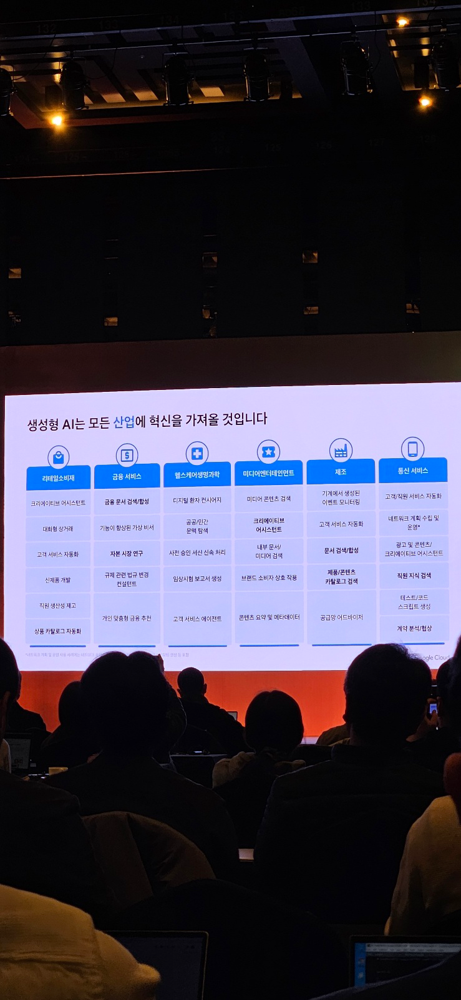

## [오프닝 키노트] 비즈니스에 혁신을 가져올 Generative AI
> 엄경순 님

## GenAI
* natural language를 활용

### 생성형 AI가 바꿀 3가지
* 온라인 상호 작용을 대화형으로 전환
  * 차량의 대시보드를 찍어서 올리면 어떤 문제가 있는지 확인을 하고 문제점에 대한 해결책을 제시
* 복잡한 데이터에 직관적으로 액세스
  * 간단한 자연어 query를 통해서 원하는 데이터에 access
* 버튼 클릭을 통한 컨텐츠 생성
  * 이미지, 동영상, 음악 생성

### GEN AI에서 가장 많이 사용되는 usecase

### GEN AI가 가진 차별성
* Pioneer
  * 2017년 Transformer 이후 대규모 언어모델의 개척자로 기술혁신 주도
* Openness
  * 파운데이션 모델의 개방형 생태계 조성해 가장 다양한 모델 제공
* Responsible AI
  * 구글의 제품폴리오에 생성형 AI기술 접목하여 혁신 주도